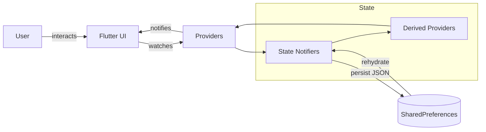

# CheckMe Todo

A premium, multi-platform Flutter productivity app that helps you capture, organize, and analyze your tasks with beautiful UI, rich animations, persistent local storage, and insightful analytics.

> Modern. Fast. Insightful. Built with Riverpod, SharedPreferences, and a custom design system.

<p align="center">
    <a href="https://flutter.dev" target="_blank">
        
    </a>
    <a href="https://dart.dev" target="_blank">
        
    </a>
    <a href="https://riverpod.dev" target="_blank">
        
    </a>
    <a href="https://pub.dev/packages/shared_preferences" target="_blank">
        
    </a>
    <a href="https://pub.dev/packages/intl" target="_blank">
        
    </a>
    <a href="https://fonts.google.com/" target="_blank">
        
    </a>
    <a href="https://m3.material.io/" target="_blank">
        
    </a>
</p>

---

## 🚀 Highlights

- Multi-Platform: Android, iOS, Web, macOS, Windows & Linux (Flutter).
- Authentication (Local): Lightweight signup/login using stored accounts (SharedPreferences).
- Task Management: Create, edit, delete, categorize, search, filter, and complete todos.
- Categories & Prioritization: Personal, School, Work, Urgent with distinct colors & icons.
- Due Dates & Overdue Detection: Smart visual indicators and highlighting of overdue tasks.
- Animated UI: Polished motion (fade, slide, scale, tab transitions, premium navigation bar).
- Analytics Dashboard: Productivity score, category performance, weekly overview & distribution.
- Achievements / Badges: Dynamic unlocks based on completion milestones & behavior.
- Light / Dark Themes: Fully themed with a custom design system (colors, spacing, typography).
- Persistent State: Per-user task isolation and storage using SharedPreferences.
- Search & Filtering: Real-time search plus category filter bottom sheet.
- Responsive Layout: Adaptive styling suitable for different form factors.

---

## 📹 Demo Video (Placeholder)

> Embed your walkthrough or promo video here.

<!-- Replace this block with an actual embed or thumbnail -->
<p align="center">
    <a href="https://your-video-link.example" target="_blank">
        
    </a>
</p>

```
<!-- Example Markdown for YouTube Embed (GitHub doesn't render iframe, so use thumbnail link): -->
[](https://youtu.be/VIDEO_ID)
```

---

## 🧩 Architecture Overview

The app follows a layered, provider-driven architecture emphasizing declarative UI and reactive state.

| Layer | Responsibility | Implementation |
|-------|----------------|----------------|
| Models | Immutable domain entities & helpers | `Todo`, `User`, `UserBadge` |
| State | Business logic & persistence | Riverpod `StateNotifier` (`AuthNotifier`, `TodoNotifier`, `ThemeNotifier`) |
| Persistence | Local storage per user | `SharedPreferences` (JSON encode/decode) |
| Presentation | Screens, widgets, theming | `screens/*`, `widgets/*`, `theme/app_theme.dart` |
| Derived State | Computed filters & projections | `filteredTodosProvider`, `completedTodosProvider`, etc. |

### Data Flow
1. UI reads reactive providers via `ref.watch(...)`.
2. User actions call notifier methods (`addTodo`, `login`, `setTheme`, etc.).
3. Notifiers mutate in-memory state & persist snapshots to `SharedPreferences`.
4. Derived providers recompute filtered views automatically.

### State Management: Why Riverpod?
- No need for BuildContext to access state.
- Compile-time safety & testability.
- Separation of concerns between UI & logic.

### Navigation
- Root: `MyApp` decides between `LandingScreen` (guest) vs `MainNavigation` (authenticated).
- `MainNavigation`: Animated bottom tab bar (Home / Analytics / Profile) using `IndexedStack`.

---

## 🛠 Tech Stack

| Category | Tools |
|----------|-------|
| Framework | Flutter (Material 3 + Google Fonts) |
| State Management | Riverpod (`flutter_riverpod`) |
| Persistence | `shared_preferences` |
| Internationalization / Formatting | `intl` (date formatting) |
| Theming & Fonts | Custom design tokens + `google_fonts` |
| Animations | Implicit & explicit animations (Controllers, Tweens, transitions) |

---

## 📂 Folder Structure

```
.
├── analysis_options.yaml
├── pubspec.yaml
├── lib/
│   ├── main.dart
│   ├── models/
│   │   ├── badge.dart
│   │   ├── todo.dart
│   │   └── user.dart
│   ├── providers/
│   │   ├── auth_provider.dart
│   │   ├── theme_provider.dart
│   │   └── todo_provider.dart
│   ├── screens/
│   │   ├── add_todo_screen.dart
│   │   ├── analytics_screen.dart
│   │   ├── home_screen.dart
│   │   ├── landing_screen.dart
│   │   ├── login_screen.dart
│   │   ├── main_navigation.dart
│   │   ├── profile_screen.dart
│   │   ├── signup_screen.dart
│   │   └── todo_detail_screen.dart
│   ├── theme/
│   │   └── app_theme.dart
│   └── widgets/
│       └── todo_item.dart
└── test/
        └── widget_test.dart
```
Other platform directories (`android/`, `ios/`, `web/`, `macos/`, `windows/`, `linux/`) are auto-generated/managed by Flutter.

### Data Flow Diagram



---

## ✅ Features In Detail

| Area | Details |
|------|---------|
| Auth | Local signup/login (demo storage) |
| Todos | CRUD operations, per-user isolation, unique IDs, categories & due dates |
| Filters | Category selection bottom sheet, live search, overdue detection |
| Analytics | Weekly overview, productivity score, category performance, distribution charts |
| Achievements | Dynamic badges (Beginner → Organizer + streak & category mastery placeholders) |
| UI/UX | Animated transitions, gradient headers, premium navigation & stat cards |
| Theming | Light/Dark, semantic color tokens, design system spacing/radius/elevation |
| Persistence | JSON serialization into SharedPreferences, per-user keys |

---

## 🔧 Getting Started

### Prerequisites
- Flutter SDK >= 3.0.0
- Dart >= 3.0.0
- A device/emulator or browser for Web

### Setup

```bash
# Clone the repository
git clone https://github.com/your-org/checkme_todo.git
cd checkme_todo

# Install dependencies
flutter pub get

# Run on a connected device or emulator
flutter run

# Run tests
flutter test
```

### Platform-Specific
- Web: `flutter run -d chrome`
- macOS/Linux/Windows: Ensure desktop support is enabled (`flutter config --enable-<platform>-desktop`).

---

## 🧪 Testing
- Includes default Flutter `widget_test.dart` (placeholder).
- Recommended additions:
    - Provider unit tests (`AuthNotifier`, `TodoNotifier`).
    - Golden tests for complex widgets.
    - Integration flow (signup → add → analytics).

---

## 🎨 Theming & Design System
Defined centrally in `theme/app_theme.dart`:
- Color primitives & gradients (`AppColors`).
- Spacing scale (`AppSpacing`).
- Radius, elevation, durations (`AppRadius`, `AppElevation`, `AppDuration`).
- Typography via Inter font (`google_fonts`).

Easily extendable for brand customization or dynamic theming.

---

## 🧠 State Management Summary
- Riverpod `StateNotifier` for mutable lists & user session.
- Derived providers project filtered/computed views (pending, completed, overdue, search, category).
- Separation of raw vs derived state encourages maintainable logic & testability.

---

## 📦 Persistence Strategy
- SharedPreferences stores:
    - Current user JSON
    - Account list JSON array
    - Per-user todo list (array of serialized todos)
- All serialization handled in model `toJson()` / `fromJson()` factories.

---

## 👥 Contributing

Contributions are welcome! Suggested workflow:
1. Fork the repo
2. Create a feature branch (`feat/your-feature-name`)
3. Commit with conventional messages (`feat: add overdue badge logic`)
4. Write/update tests where relevant
5. Open a Pull Request with a clear description & screenshots

Please also consider adding documentation for new providers or architectural changes.

---

## 🙌 Acknowledgements
- Flutter & Dart teams
- Riverpod maintainers
- Google Fonts (Inter)

---

## 📬 Contact
Add your contact or support channel here:
- Email: you@example.com
- Portfolio: https://your-portfolio.example
- LinkedIn: https://linkedin.com/in/your-handle

---

Elevating productivity through thoughtful design, resilient architecture, and a smooth developer experience—thanks for reading, and happy building.
       
